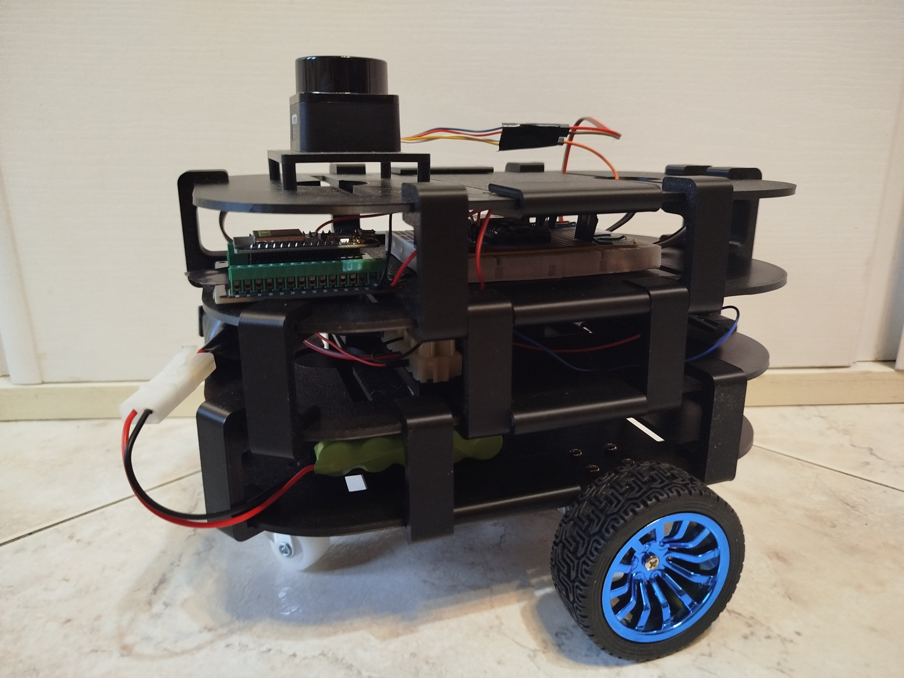

# Leonardo ESP32 Differential-Drive Unicycle Robot with micro-ROS and ROS 2 Humble

A mobile differential-drive unicycle robot powered by an **ESP32** microcontroller and seamlessly integrated with **ROS 2 Humble** and **micro-ROS** over Wi‑Fi. It fuses wheel encoder data and IMU measurements for accurate odometry, publishes LiDAR scans for SLAM, and subscribes to gamepad commands for teleoperation.



> **Demo Video:** `docs/video/demo.mp4`

## 🗂️ Directory Layout

```text
/
├── leonardo/                 # Companion PC ROS 2 workspace
├── Leonardo_esp32/           # Primary ESP32 firmware
├── Leonardo_Lidar/           # Secondary ESP32 LiDAR node
├── libraries_arduinoIDE/     # Custom Arduino libraries
├── chassis_leonardo_3Dprint/ # 3D chassis CAD & STLs
├── docs/
│   ├── img/                  # Project images
│   └── video/                # Demo videos
└── README.md                 # This overview file
```

---

## 📦 Dependencies

Before getting started, make sure you have the following installed on your companion PC:

* **ROS 2 Humble Hawksbill**
* **micro-ROS Agent**

  ```bash
  sudo apt update
  sudo apt install ros-humble-micro-ros-agent
  ```
* **ROS Toolbox (slam\_toolbox)**

  ```bash
  sudo apt install ros-humble-slam-toolbox
  ```
* **Nav2 (Navigation2 stack)**

  ```bash
  sudo apt install ros-humble-nav2-bringup
  ```
* **RViz 2**

  ```bash
  sudo apt install ros-humble-rviz2
  ```

Additional system dependencies:

* Python 3.10+ packages: `colcon-common-extensions`, `rosdep`
* Arduino IDE (for firmware builds)

---

## 🔧 Hardware Setup

* **Microcontroller:** ESP32 DevKit (Wi‑Fi enabled)
* **Wheel Encoders:** Magnetic encoders on 12 V DC motors (25GA‑370, 130 RPM)
* **IMU:** MPU6050 via I2C (SDA/SCL)
* **Motor Driver:** L298N (PWM + digital direction pins)
  [motorDriver library](https://github.com/EmDonato/motorDriver.git)
* **LiDAR:** LD06 on secondary ESP32
  [LD06 module](https://github.com/EmDonato/ld06_esp32_microRos.git)
* **Battery:** 12 V NiMH pack
* **DC-DC Converter:** XL4015 step‑down module

---

## 🚀 Core Components

### Companion PC (`leonardo`)

* Teleoperation: `joy_node` & `teleop_twist_joy` for gamepad control
* Command Arbitration: `twist_mux` merging multiple `/cmd_vel` sources
* TF Broadcasters: `odom → base_link`, `base_link → base_laser`
* Time Synchronization: `/time_sync` messages align PC and ESP32 clocks
* SLAM Mapping: `slam_toolbox` for real-time 2D mapping
* Navigation: Nav2 bringup for path planning and recovery behaviors
* Visualization: preconfigured RViz2 layout

### ESP32 Firmware Modules

#### Main ESP32 (`Leonardo_esp32`)

* Odometry: complementary filter fusing encoder + IMU data
* Control: feedforward + PID loops generating motor commands
* micro-ROS: publishes `/odom`, subscribes `/cmd_vel_mux`, etc.

#### LiDAR Node (`Leonardo_Lidar`)

* Packet Parsing: decodes LD06 scan data into distances & confidences
* Scan Assembly: builds full 360° `LaserScan` messages
* Timestamp Sync: applies PC-derived offset for accurate stamps
* ROS 2 Interface: publishes scans and debug logs

### Libraries (`libraries_arduinoIDE`)

* Motor driver abstractions
* PID controller utilities (with feedforward and deadzone)

### Chassis Model (`chassis_leonardo_3Dprint`)

* CAD files and STL exports for 3D-printing the robot chassis

---

## 📋 Recent Updates

* **Unified Workspace:** merged PC and ESP32 projects into one directory structure
* **Time Sync:** added periodic `/time_sync` publisher and subscriber nodes
* **Twist\_mux:** configured priority and timeouts for manual vs. autonomous commands
* **IMU msg:** send imu msg
* **LiDAR Node:** enhanced error handling and synchronized scans every 30 s
* **Libraries:** released motor driver feedforward update and advanced PID tuning
* **Nav2 confi file** added config file for nav2 DWB control and PP control (not recommended)
---

## 🚀 Next Steps

* Integrate autonomous exploration

---

## ⚙️ Usage Examples

### 1️⃣ Source Workspace & Launch Leonardo

```bash
# Build and source your workspace:
colcon build --symlink-install
source install/setup.bash

# Launch the main robot bringup:
ros2 launch leonardo launch_leonardo.py
```

### 2️⃣ SLAM (slam\_toolbox)

```bash
ros2 launch slam_toolbox online_async_launch.py \
  slam_params_file:=/your/Full/path/Leonardo/src/mio_slam_toolbox/config/mapper_params_online_async.yaml
```

### 3️⃣ Navigation (Nav2)

```bash
ros2 launch nav2_bringup navigation_launch.py \
  params_file:=/your/Full/path/Leonardo/config/config_param_nav2DWB.yaml
```

---

## 📄 License

Released under the **MIT License**. See [LICENSE](LICENSE) for details.
